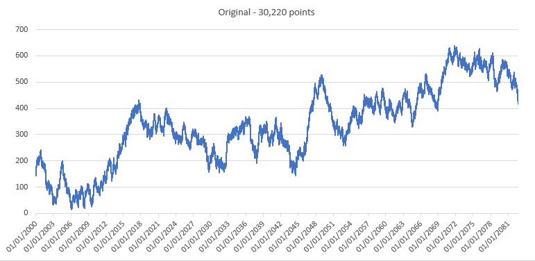
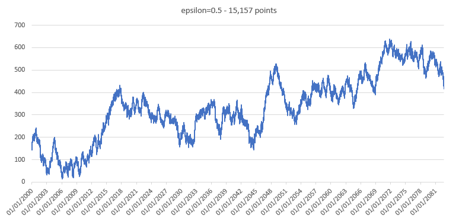
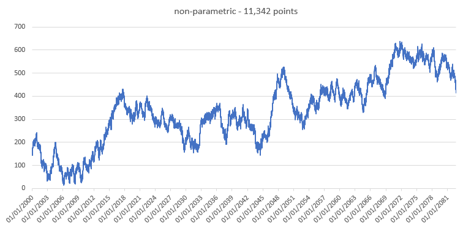

# Ramer-Douglas-Peucker algorithm
## Description
_An algorithm that decimates a curve composed of line segments to a similar curve with fewer points.
The purpose of the algorithm is, given a curve composed of line segments (which is also called a Polyline in some contexts), to find a similar curve with fewer points. The algorithm defines 'dissimilar' based on the maximum distance between the original curve and the simplified curve (i.e., the Hausdorff distance between the curves). The simplified curve consists of a subset of the points that defined the original curve._[`source wiki`](https://en.wikipedia.org/wiki/Ramer%E2%80%93Douglas%E2%80%93Peucker_algorithm)

## [Implementation](RamerDouglasPeuckerNetV2.Test/RamerDouglasPeuckerNetV2/RamerDouglasPeucker.cs)
The [pseudo-code](https://en.wikipedia.org/wiki/Ramer%E2%80%93Douglas%E2%80%93Peucker_algorithm#Pseudocode) is available on the wikipedia page. In this implementation, we use the [__perpendicular distance__](https://en.wikipedia.org/wiki/Distance_from_a_point_to_a_line).

In order to make the algorithm faster, we consider the squared distance (and epsilon) so that we avoid using the _absolute value_ and _square root_ functions in the distance computation. We also split the computation of the distance so that we put in the 'for loop' only what is needed (the denominator is only computed once).

Perpendicular distance formula:

## Non-parametric version
See [A novel framework for making dominant point detection methods non-parametric](https://core.ac.uk/download/pdf/131287229.pdf) by Prasad, Leung, Quek, and Cho. 
### From the paper: 
_3.1.2. __Non-parametric adaptation of RDP___

_In the above method, at each step in the recursion, if the length of the line segment that is fit most recently on the curve (or sub-curve) is_ s _and the slope of the line segment is_ m, _then using Eq.(4), we compute_ dmax _and use it in Eq.(7) as_ dtol=dmax. _The pseudocodes of the original and the modified methods are given in Fig. 3 and the changes are highlighted for the ease of comparison. As a consequence of theproposed modification, the original method does not require any control parameter and adaptively computes the suitable value of_ dtol _automatically._

## Results
### Original

### Reduced to 15,157 points (e=0.5)

### Reduced to 11,342 points (non-parametric)

### Reduced to 1,385 points (e=10)

